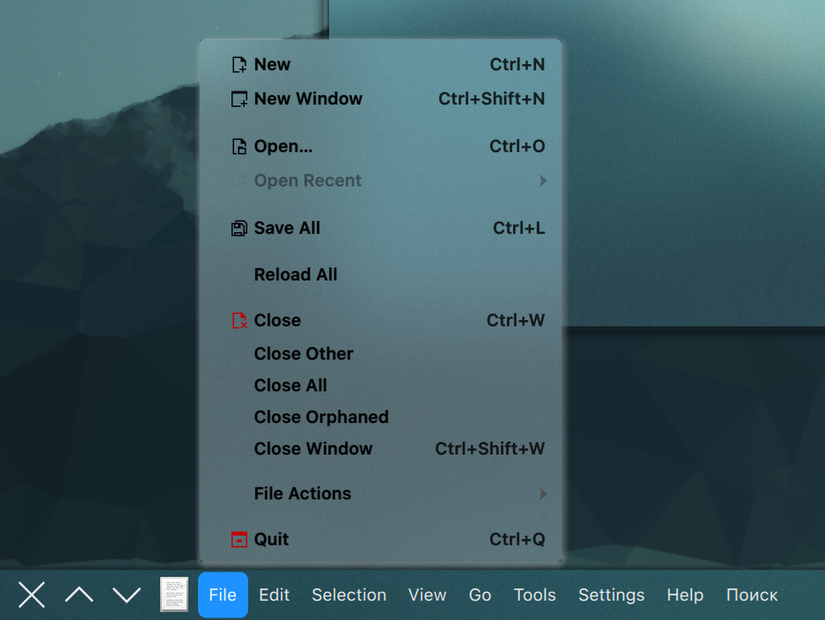

# Application Title Bar with App Menu

[](LICENSE)
[](https://github.com/uselessfire/application-title-bar-appmenu/releases/latest)
[](https://github.com/uselessfire/application-title-bar-appmenu/actions/workflows/ci.yml)

A KDE Plasma 6 panel widget with the title, the buttons and the **application menu** of the
active window, like the top panel of Unity: the menu takes the place of the title while the
pointer is over the widget.



It is a fork of [Application Title Bar](https://github.com/antroids/application-title-bar) by
Anton Kharuzhy and keeps all of its features. The application menu is built on the code of the
Global Menu widget of Plasma, see [Credits](#credits).

It is a widget of its own: both can be installed side by side, and the settings of an
Application Title Bar in a panel are not taken over.

## Features

Everything [Application Title Bar](https://github.com/antroids/application-title-bar) has:
window buttons, the window title and icon, actions on clicks and on the mouse wheel,
theming, dragging windows by the widget and more. On top of that, the **Application menu bar**
element:

* The menu of the active window, including submenus, icons, shortcuts, check boxes and
  menus that the application fills when they are opened.
* In place of the title while the widget is hovered, or permanently next to the other elements.
* Switching between menus by moving the pointer or with the arrow keys, like in a menu bar.
* Mnemonics: Alt+letter in the application opens its menu in the panel, and the letters are
  underlined while Alt is held.
* The global shortcut of the widget opens its first menu.
* A search entry for the actions of the menu (Wayland only, like in the Global Menu).
* All panel edges. The menu is not shown on vertical panels.

The widget also works without the compiled menu module, as plain Application Title Bar.
Its settings then explain how to get the module.

## Requirements

* Plasma 6. It is developed and tested with Plasma 6.7 on Wayland; X11 should work like with
  the stock Global Menu, but is not tested. The build requires at least Plasma 6.4, Qt 6.8 and
  KDE Frameworks 6.14.
* The **Global Menu service** of Plasma (the kded module `appmenu`). Applications only export
  their menus while it runs. The settings of the widget show whether it is enabled and offer to
  enable it. It can be enabled from a terminal as well:

  ```bash
  busctl --user call org.kde.kded6 /kded org.kde.kded6 setModuleAutoloading sb appmenu true
  busctl --user call org.kde.kded6 /kded org.kde.kded6 loadModule s appmenu
  ```

* Qt and KDE applications export their menus without further setup. GTK 3 applications need
  a GTK module: `appmenu-gtk-module-wayland` on Wayland (AUR) or `appmenu-gtk-module` on X11.
  Applications started before the service was enabled need a restart.

Do not keep the stock Global Menu widget on your panels at the same time: both open their
menu when an application asks for it with Alt+letter.

## Installation

### Arch Linux

Download the package from the [latest release](https://github.com/uselessfire/application-title-bar-appmenu/releases/latest)
and install it:

```bash
sudo pacman -U plasma6-applets-application-title-bar-appmenu-*-x86_64.pkg.tar.zst
```

To build the package yourself, use the `PKGBUILD` and the `.install` file attached to the release:
the release workflow fills in the checksum of the released sources there. Put them in an empty
directory and run `makepkg -si`. The copy in [`packaging/arch`](packaging/arch/PKGBUILD) has
`SKIP` instead of the checksum, since it cannot know the checksum of its own release.

### From the sources

Build dependencies: CMake, extra-cmake-modules, Qt 6 (Base with DBus and Widgets, Declarative),
KF6 I18n and libplasma, with their development files. At runtime the widget needs
Kirigami, KSvg, KCMUtils, KWindowSystem, plasma5support and plasma-workspace, which a
Plasma desktop has anyway.

```bash
git clone https://github.com/uselessfire/application-title-bar-appmenu.git
cd application-title-bar-appmenu
cmake -B build -DCMAKE_INSTALL_PREFIX=/usr -DCMAKE_BUILD_TYPE=Release -DBUILD_TESTING=OFF
cmake --build build
sudo cmake --install build
```

This installs the widget and the menu module for all users.

### Widget only

The `.plasmoid` file of a release installs the widget for the current user, **without the
application menu**:

```bash
kpackagetool6 -t Plasma/Applet -i application-title-bar-appmenu-*.plasmoid
```

A widget installed this way takes precedence over the one of the package, even when it is
older. Remove it after installing the package:

```bash
kpackagetool6 -t Plasma/Applet -r com.github.uselessfire.application-title-bar-appmenu
```

After an upgrade, restart Plasma to load the new version:
`systemctl --user restart plasma-plasmashell.service`

## Configuration

Add **Application Title Bar with App Menu** to a panel. In its settings, on the Appearance page:

* **Widget elements**: the *Application menu bar* element is at the end of the default list.
  Move it where the menu should be, next to the title for the hover mode.
* **Show menu**: *In place of the title, while the widget is hovered*. Without it, the menu is
  always shown next to the title.
* **Search**: *Add a search entry* to the menu (Wayland only).
* **Fill free space on Panel**: the title takes the free space of the panel, up to its
  *Maximum width*, and all of it reveals the menu.

## Notes

* The Plasma shell may crash with *"tried to set blur region on destroyed surface"* in the
  journal when a translucent menu closes and opens again
  ([KDE bug 522547](https://bugs.kde.org/show_bug.cgi?id=522547)). With a style that blurs
  menus only when they have a region to blur, like Kvantum, the stock Global Menu triggers it
  every time it is closed after showing an empty menu. The menus of this widget keep their
  native surfaces and skip empty menus, so they do not trigger it.
* Debug output of the menu module can be enabled with `kdebugsettings` (category
  *Application Title Bar AppMenu*) or with
  `QT_LOGGING_RULES="com.github.uselessfire.applicationtitlebar.appmenu*.debug=true"`.

## In case of panel freezes or crashes

Remove the widget from the panel, or remove the local copy of it:
`kpackagetool6 -t Plasma/Applet -r com.github.uselessfire.application-title-bar-appmenu`.
Please report the issue.

## Development

```bash
cmake -B build -DCMAKE_BUILD_TYPE=Debug -DBUILD_TESTING=ON
cmake --build build
ctest --test-dir build --output-on-failure
```

The tests start their own D-Bus session with `dbus-run-session` and use the offscreen Qt
platform, so they never touch the menus of the running desktop.

* `plugin/`: the QML module `com.github.uselessfire.applicationtitlebar.appmenu` with the
  menu model and the controller that shows the menus.
* `3rdparty/libdbusmenuqt/`: the DBusMenu client library of Plasma, see its README.
* `package/`: the plasmoid. Only `AppMenuBackend.qml` imports the module, through a Loader.
* `packaging/arch/`: the PKGBUILD. `.github/workflows/releases.yml` builds the release from it.

## Credits

* [Application Title Bar](https://github.com/antroids/application-title-bar) by Anton Kharuzhy,
  which this widget is a fork of.
* [application-title-bar-menu](https://github.com/darkbroodzed/application-title-bar-menu) by
  darkbroodzed, where the *Application menu bar* element and its hover mode appeared first.
* The Global Menu widget of [Plasma](https://invent.kde.org/plasma/plasma-workspace)
  (Kai Uwe Broulik, Chinmoy Ranjan Pradhan and contributors): the menu model and the way menus
  are shown are adapted from it, and its libdbusmenuqt is included.

## License

GPL-3.0-or-later, see [LICENSE](LICENSE). The code taken from Plasma keeps its licenses:
GPL-2.0-only OR GPL-3.0-only (the menu module), LGPL-2.0-or-later (libdbusmenuqt) and
GPL-2.0-or-later (the menu button). The texts are in [LICENSES](LICENSES).
